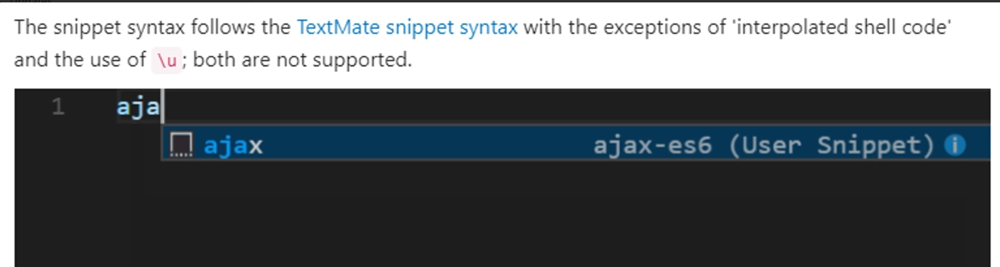

~~上班不划水，那还上个鬼~~~

呐呐呐，，今天我又来给大家安利一个个人甚至是团队提高编码效率的好东西——vscode语法提示之用户片段。

### 什么是用户片段

官方介绍：In Visual Studio Code, snippets appear in IntelliSense (Ctrl+Space) mixed with other suggestions, as well as in a dedicated snippet picker (**Insert Snippet** in the Command Palette). 

简而言之就是：咱们输入一些单词前缀时，会自动匹配和提示跟这些前缀相关的内容，让我们方便输入我们想要输入的内容。

**哦豁，这不就是低代码的一种吗！其实开发过程中很多代码和逻辑都是重复的。如果我们将一些重复的代码和逻辑，都配置成用户片段，写出前缀就会提示对应的内容，这效果就有点类似于CodePilot**

用户片段配置后同样会在我们输入一些相关词汇前缀的时候提示我们（如下），而选中之后显示的内容就是我们设置的用户片段了。

### 用户片段用途

之所以叫做用户片段，是因为这东西可以根据个人需求自定义化，可以创建归属于**语言、项目、用户**的用户片段，这意味着不同的语言（css、html、javascript…）、项目可以根据需要设置不同的片段提示，也可以设置全局的片段提示，在任何地方都能用。

一些平时常用的类似语法，比如打印日志、导入内容、react/vue语法模板、增删查改操作等都可以进行配置，需要用到的时候直接输入前缀匹配对应的内容即可。

**所以说，它可以帮助我们~~划水摸鱼！~~提高个人或团队的编程效率，使用这个，个人可以配置属于自己的专有提示，团队也可以在项目中放置对应的提示模板，提高变成效率的同时，也可以统一编程代码风格！**

### 用户片段怎么使用

1. 根据自己需求手动创建配置，点击文件→ 首选项 → 配置用户代码片段（或按Ctrl + Shift + P快捷键，然后输入代码片段）

    

    （1）点击新建全局代码片段文件会新建不限于项目的用户片段文件

    - 点击新建全局代码片段文件后，输入文件名，然后按下"Enter"键，就会跳转全局代码片段的文件

        

    （2）点击新建"xxx"文件夹的代码片段文件会新建项目内部的代码片段文件。

    - 输入用户片段文件名
    - 输入之后按下"Enter"键就会生成一个有效范围在项目内的文件，如图所示为文件的配置模板。这里大概讲一下常见的配置项，如果需要深入了解，可以访问官网学习。

        

    （3）语法：如上，模板给出的示例配置为常用的配置项。从外到内看，这是一个json文件，删除掉对于代码片段的解释，然后解开注释符。

    - 对象属性：作为json对象的key，没有其他的作用，这里对应"Print to console"；
    - scope：代码片段应用的语言，用逗号隔开可以写多个；
    - prefix：语法提示的前缀，比如这里写了一个为log，那么当你在写代码时，打出log的时候，就会有相关的提示，具体展示可以参考最上面的官方示例；
    - body：提示的内容，点击对应的代码片段提示之后要展示什么内容，就在这里定义了；
    - description: 代码片段描述，例如你这个代码片段提示是干嘛的，噼里啪啦写一下。

        

2. 使用别人写好的语法提示插件
输入想要的语言，然后使用@category:"snippets"就可以找出跟用户片段相关的插件，安装插件后，就可以使用这些插件自带的用户片段内容了。

    

    各种语言的都有，比如说你要搜react的，如下：

    

    查看插件，可以发现它提供了很多提示，光是console的就有很多，不过常用的可能才几个，比如"clo"

    

### 备注

1. snippets官网链接：https://code.visualstudio.com/docs/editor/userdefinedsnippets
2. 代码生成snippet工具：[snippet-generator.app](https://snippet-generator.app)
